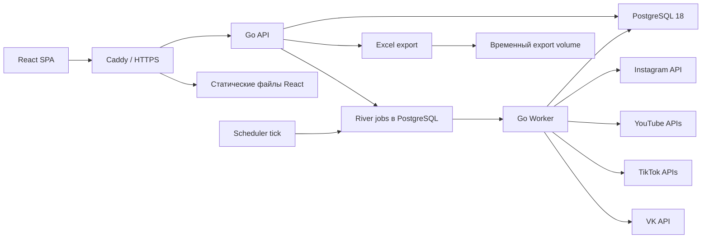

# План реализации системы статистики креаторов

## 1. Итоговая архитектура и зафиксированные решения

Система самостоятельно подключается к официальным API Instagram, YouTube, TikTok и VK, обнаруживает публикации, регулярно собирает доступную статистику, связывает аккаунты с креаторами и формирует дашборды и Excel-отчеты.

Принятые решения:

- Backend и фоновые сборщики: Go 1.26.
- HTTP: стандартный `net/http` + `chi`.
- База: PostgreSQL 18.
- Доступ к БД: `pgx/v5` + `sqlc`.
- Миграции: `goose`.
- Фоновые задания: River на PostgreSQL, без Redis.
- Frontend: React 19 + TypeScript + Vite.
- Server state: TanStack Query.
- UI state: Zustand.
- Маршрутизация: React Router.
- Таблицы: TanStack Table.
- Графики: Apache ECharts.
- Стили: CSS Modules + SCSS (Sass); общие design tokens и базовые стили — в глобальных SCSS-файлах.
- UI-компоненты: Radix UI; собственные компоненты оформляются через CSS Modules, без Tailwind и shadcn.
- Excel: Excelize на backend.
- API-контракт: OpenAPI 3.0, `oapi-codegen` для Go и `openapi-typescript` для frontend.
- Авторизация пользователей: локальные аккаунты, secure cookie, роли.
- Подключение платформ: административный OAuth.
- Развертывание: Docker Compose на VPS, Caddy как reverse proxy и TLS-терминатор.
- Исходные API-ответы: PostgreSQL JSONB с ограниченным сроком хранения; S3 для них не используется.
- Масштаб по умолчанию: до 100 креаторов и примерно 400 платформенных аккаунтов.
- Бизнес-часовой пояс по умолчанию: `Europe/Samara`; все технические timestamps хранятся в UTC.
- Сбор данных работает автономно; кнопка «Обновить сейчас» является дополнительной.
- Prisma не используется: после отдельного выбора зафиксирован Go backend, а официальный Prisma Client генерирует TypeScript и не поддерживает нативный Go runtime. Использование Prisma только для миграций создало бы второй источник истины. [Prisma Client generator](https://www.prisma.io/docs/orm/prisma-schema/overview/generators).

Актуальные базовые версии на момент проектирования: [Go 1.26.5](https://go.dev/VERSION?m=text), [PostgreSQL 18.4](https://www.postgresql.org/support/versioning/), [React 19.2](https://react.dev/versions), [ECharts 6.1](https://echarts.apache.org/en/index.html).

---

## 2. Компоненты и взаимодействие



### Основные процессы

1. Администратор создает креатора.
2. В карточке креатора запускает подключение платформы.
3. Backend создает OAuth state и перенаправляет администратора на платформу.
4. Callback обменивает authorization code на access/refresh token.
5. Токены шифруются и сохраняются отдельно от данных аккаунта.
6. Backend получает внешний идентификатор аккаунта и привязывает его к креатору.
7. В очередь ставится первичное обнаружение публикаций.
8. Worker получает публикации, сохраняет их и планирует сбор метрик.
9. Снимки накопительных метрик сохраняются без перезаписи предыдущих.
10. Ночной агрегатор строит дневные показатели.
11. API отдает frontend уже нормализованные данные.
12. TanStack Query кэширует server state, Zustand хранит только состояние интерфейса.
13. Excel формируется backend-воркером из тех же SQL-запросов, что использует дашборд.

---

## 3. Структура репозитория и файлы

```text
statzavod/
├── api/
│   ├── openapi.yaml
│   └── examples/
│       ├── dashboard-summary.json
│       └── problem-details.json
│
├── cmd/
│   ├── api/
│   │   └── main.go
│   ├── worker/
│   │   └── main.go
│   ├── migrate/
│   │   └── main.go
│   ├── admin/
│   │   └── main.go
│   └── probe/
│       └── main.go
│
├── internal/
│   ├── app/
│   │   ├── api.go
│   │   └── worker.go
│   ├── config/
│   │   ├── config.go
│   │   └── validate.go
│   ├── database/
│   │   ├── pool.go
│   │   ├── tx.go
│   │   └── generated/          # sqlc output
│   ├── transport/http/
│   │   ├── server.go
│   │   ├── middleware.go
│   │   ├── errors.go
│   │   └── generated/          # oapi-codegen output
│   ├── auth/
│   │   ├── service.go
│   │   ├── password.go
│   │   ├── session.go
│   │   ├── csrf.go
│   │   └── permissions.go
│   ├── users/
│   ├── creators/
│   ├── accounts/
│   ├── publications/
│   ├── contentgroups/
│   ├── metrics/
│   │   ├── definitions.go
│   │   ├── normalize.go
│   │   ├── deltas.go
│   │   ├── daily.go
│   │   └── coverage.go
│   ├── dashboard/
│   ├── exports/
│   │   ├── service.go
│   │   ├── workbook.go
│   │   └── sanitization.go
│   ├── notifications/
│   ├── audit/
│   ├── crypto/
│   │   ├── envelope.go
│   │   └── rotation.go
│   ├── jobs/
│   │   ├── client.go
│   │   ├── scheduler.go
│   │   ├── discover.go
│   │   ├── collect.go
│   │   ├── aggregate.go
│   │   ├── export.go
│   │   └── cleanup.go
│   └── platforms/
│       ├── platform.go
│       ├── client.go
│       ├── errors.go
│       ├── ratelimit.go
│       ├── instagram/
│       │   ├── client.go
│       │   ├── oauth.go
│       │   ├── publications.go
│       │   ├── metrics.go
│       │   └── normalize.go
│       ├── youtube/
│       ├── tiktok/
│       └── vk/
│
├── db/
│   ├── migrations/
│   ├── queries/
│   │   ├── users.sql
│   │   ├── creators.sql
│   │   ├── accounts.sql
│   │   ├── publications.sql
│   │   ├── metrics.sql
│   │   ├── dashboard.sql
│   │   ├── sync.sql
│   │   └── exports.sql
│   ├── fixtures/
│   └── seed/
│
├── web/
│   ├── src/
│   │   ├── app/
│   │   │   ├── App.tsx
│   │   │   ├── router.tsx
│   │   │   ├── providers.tsx
│   │   │   └── queryClient.ts
│   │   ├── pages/
│   │   ├── features/
│   │   │   ├── auth/
│   │   │   ├── dashboard/
│   │   │   ├── creators/
│   │   │   ├── publications/
│   │   │   ├── content-groups/
│   │   │   ├── integrations/
│   │   │   ├── exports/
│   │   │   ├── sync-health/
│   │   │   └── users/
│   │   ├── shared/
│   │   │   ├── api/
│   │   │   │   ├── generated/
│   │   │   │   ├── client.ts
│   │   │   │   └── queryKeys.ts
│   │   │   ├── charts/
│   │   │   ├── tables/
│   │   │   ├── ui/
│   │   │   │   ├── Button.tsx
│   │   │   │   └── Button.module.scss
│   │   │   ├── forms/
│   │   │   ├── stores/
│   │   │   │   └── uiStore.ts
│   │   │   ├── dates/
│   │   │   └── formatting/
│   │   ├── styles/
│   │   │   ├── _tokens.scss
│   │   │   └── globals.scss
│   │   └── test/
│   ├── e2e/
│   └── public/
│
├── test/
│   ├── contract/
│   ├── integration/
│   ├── performance/
│   └── platform-fixtures/
│
├── deploy/
│   ├── Dockerfile.api
│   ├── Dockerfile.web
│   ├── compose.production.yml
│   ├── compose.development.yml
│   ├── Caddyfile
│   ├── backup.sh
│   └── systemd/
│
├── .github/workflows/
│   ├── ci.yml
│   ├── security.yml
│   └── deploy.yml
├── sqlc.yaml
├── oapi-codegen.yaml
├── Taskfile.yml
├── go.mod
├── go.sum
├── .env.example
└── README.md
```

Сгенерированные файлы `sqlc` и OpenAPI коммитятся, чтобы изменения контрактов были видны в code review.

---

## 4. PostgreSQL и модель данных

### Общие правила

- PostgreSQL 18.4.
- Идентификаторы: `uuid`, создаваемые через PostgreSQL `uuidv7()`.
- Время: `timestamptz` в UTC.
- Бизнес-день: `date`, рассчитанный в `Europe/Samara`.
- Счетчики: `bigint`.
- Длительность: `bigint` в миллисекундах.
- Проценты и rates: `numeric(18,8)`.
- Деньги: `bigint` в micros + `char(3)` currency.
- Платформенные metadata: `jsonb`.
- Отсутствующая метрика хранится как `NULL`, а не как `0`.
- Все внешние сущности имеют уникальный ключ `(platform, external_id)`.
- Удаление креаторов, аккаунтов и публикаций — мягкое; статистика не теряется.
- До 100 креаторов партиционирование не добавляется преждевременно. Для временных таблиц создаются BRIN/B-tree индексы. Порог пересмотра — 10 млн снимков либо p95 аналитических запросов выше 500 мс после оптимизации.

### Пользователи и безопасность

#### `users`

- `id`
- `email`
- `password_hash`
- `role`: `ADMIN`, `ANALYST`, `VIEWER`
- `status`: `INVITED`, `ACTIVE`, `SUSPENDED`
- `last_login_at`
- `created_at`, `updated_at`

Email нормализуется в lowercase и защищается уникальным индексом.

#### `user_invitations`, `password_reset_tokens`

Хранят только SHA-256 hash одноразового токена, срок действия и факт использования.

#### `sessions`

- hash случайного session token;
- пользователь;
- `expires_at`, `last_seen_at`;
- IP и user-agent для аудита;
- revoke timestamp.

#### `audit_logs`

Кто, когда и что изменил:

- создание/архивация креатора;
- просмотр/изменение контактов;
- подключение/отключение аккаунта;
- повторная авторизация;
- изменение ролей;
- ручной запуск синхронизации;
- создание отчета;
- подтверждение объединения креативов.

Токены, пароли и полные API-ответы в audit log не записываются.

### Креаторы

#### `creators`

- имя, фамилия, отчество;
- `display_name`;
- внутренний комментарий;
- статус `ACTIVE`/`ARCHIVED`;
- timestamps.

Архивация останавливает новые плановые сборы, но сохраняет историю и отчеты.

#### `creator_contacts`

- `creator_id`;
- тип: телефон, email, Telegram, WhatsApp, другое;
- значение;
- `is_primary`;
- label;
- timestamps.

Контакты видят Admin и Analyst; Viewer видит только имя и публичные ссылки аккаунтов.

### Платформенные аккаунты

#### `platform_accounts`

- `platform`;
- `external_id`;
- username;
- display name;
- profile URL;
- avatar URL;
- тип аккаунта;
- статус `ACTIVE`, `PAUSED`, `REAUTH_REQUIRED`, `DISCONNECTED`;
- metadata JSONB;
- последняя успешная синхронизация;
- причина последней ошибки.

#### `creator_account_assignments`

- `creator_id`;
- `platform_account_id`;
- `valid_from`, `valid_to`;
- кто выполнил назначение.

Частичный уникальный индекс запрещает две активные привязки одного аккаунта к разным креаторам.

Публикация получает `creator_id` при обнаружении. При передаче аккаунта новому креатору старые публикации остаются у прежнего креатора; новые получают нового. Исправление ошибочной привязки выполняется отдельным аудитируемым bulk-действием.

#### `oauth_connections`

- `platform_account_id`;
- access/refresh token ciphertext;
- nonce;
- версия ключа;
- scopes;
- expires_at;
- последний refresh;
- статус.

Токены шифруются AES-256-GCM, ключ передается контейнеру как secret и не хранится в БД.

### Публикации и креативы

#### `publications`

- `creator_id`;
- `platform_account_id`;
- `platform`;
- `external_id`;
- тип: Reel, Short, TikTok video, VK Clip;
- заголовок и описание;
- permalink;
- thumbnail;
- duration;
- width/height;
- `published_at`;
- статус `ACTIVE`, `PRIVATE`, `DELETED`, `UNKNOWN`;
- metadata JSONB;
- discovered/updated timestamps.

#### `content_groups`

Представляет один исходный креатив, опубликованный на нескольких платформах:

- `creator_id`;
- внутреннее название;
- статус;
- created by;
- timestamps.

#### `content_group_members`

Одна публикация может входить только в один креатив.

#### `content_match_suggestions`

Система не объединяет публикации автоматически, а создает предложение.

Кандидаты должны:

- принадлежать одному креатору;
- находиться на разных платформах;
- быть опубликованы с разницей не более 72 часов.

Score 0–100:

- близость длительности — 35;
- близость времени публикации — 30;
- сходство нормализованного описания — 25;
- совпадение соотношения сторон/разрешения — 10.

При отсутствующем признаке остальные веса нормализуются до 100. Предложение создается от 70 баллов. Администратор видит причины score и подтверждает или отклоняет его. Автоматического linking нет.

### Метрики

Используется гибридная схема: нормализованные частые метрики — колонками, редкие платформенные — в отдельной таблице.

#### `publication_metric_snapshots`

- `publication_id`;
- `observed_at`;
- views/plays;
- engaged views;
- reach;
- likes;
- comments;
- shares;
- saves/favorites;
- watch time;
- average watch time;
- followers gained/lost;
- revenue micros/currency при разрешенном scope;
- response/API version;
- completeness status.

#### `publication_daily_metrics`

- `publication_id`;
- `activity_date`;
- нормализованные показатели за день;
- `source_method`: `NATIVE_DAILY`, `SNAPSHOT_DELTA`;
- `is_complete`;
- `is_correction`;
- coverage metadata;
- timestamps.

#### `account_metric_snapshots`, `account_daily_metrics`

Подписчики, общее число публикаций, account reach/visitors и прочие показатели аккаунта.

#### `native_metric_values`

- ссылка на snapshot или daily row;
- `metric_key`;
- numeric/text/JSON value;
- unit;
- platform;
- API version.

#### `metric_breakdowns`

- дата;
- публикация или аккаунт;
- dimension type: страна, город, возраст, пол, устройство, OS, источник трафика;
- dimension value;
- metric key/value.

#### `metric_capabilities`

Фиксирует фактическую доступность метрики:

- платформа;
- account/media type;
- metric key;
- `AVAILABLE`, `UNAVAILABLE`, `REQUIRES_SCOPE`, `PRIVACY_THRESHOLD`, `DEPRECATED`;
- последнее подтверждение;
- версия API.

Это предотвращает превращение недоступной метрики в ноль.

### Синхронизация

#### `sync_targets`

- target type/id;
- тип операции;
- cadence;
- `next_sync_at`;
- last success/error;
- consecutive failures;
- статус.

#### `sync_runs`

История каждого обращения:

- начало/конец;
- platform/account/publication;
- endpoint;
- outcome;
- HTTP status;
- retry count;
- records read/written;
- rate-limit metadata;
- correlation ID.

#### `raw_api_responses`

- provider/endpoint;
- target;
- sanitized request metadata;
- HTTP status;
- response JSONB;
- API version;
- collected/expires timestamps.

Retention:

- успешные ответы — 30 дней;
- ошибки и неизвестные схемы — 180 дней;
- нормализованные метрики — бессрочно.

Authorization headers, tokens и персональные секреты перед сохранением удаляются.

### Экспорты и уведомления

#### `export_jobs`

Статус, фильтры, пользователь, путь к файлу, размер, expiration. Файл хранится на общем Docker volume 24 часа, затем удаляется cleanup job.

#### `notifications`

Ошибки OAuth, отставание синхронизации, критические ошибки парсинга и системные предупреждения.

---

## 5. Миграции и SQL

- `goose` хранит последовательные SQL-миграции в `db/migrations`.
- Миграции встраиваются в migrator binary через `embed.FS`.
- В development: `task db:migrate`.
- В production: one-shot `migrator` перед запуском нового API/worker.
- River использует собственные официальные миграции после migrations приложения. [River migrations](https://riverqueue.com/docs).
- Никаких изменений production-схемы через ручной SQL.
- Миграции проходят staging и тест восстановления до production.
- Изменения выполняются по expand-contract:
  1. добавить совместимое поле/таблицу;
  2. задеплоить код, который умеет оба варианта;
  3. выполнить backfill;
  4. только потом удалять старое.
- `sqlc.yaml` использует `engine: postgresql` и `sql_package: pgx/v5`. [sqlc + pgx](https://docs.sqlc.dev/en/stable/guides/using-go-and-pgx.html).
- Сложные dashboard-запросы остаются явным SQL, а не собираются динамическим ORM.
- Все пользовательские параметры передаются параметризованно.
- Для тяжелых агрегатов добавляются materialized views только после измерения реальной необходимости.

---

## 6. HTTP API и публичные контракты

### Базовые правила

- Prefix: `/api/v1`.
- JSON: `camelCase`.
- Время: ISO-8601 UTC.
- Бизнес-дата: `YYYY-MM-DD`.
- Ошибки: RFC Problem Details, `application/problem+json`.
- Списки: cursor pagination, `limit` максимум 100.
- Мутации возвращают обновленную сущность либо `202 Accepted` для фоновых операций.
- Каждый ответ содержит request ID.
- OpenAPI является источником истины.
- `oapi-codegen` генерирует strict Go server interface.
- `openapi-typescript` генерирует frontend-типы и client.
- CI падает, если генерация меняет закоммиченные файлы.

### Auth

```text
POST   /auth/login
POST   /auth/logout
GET    /auth/me
POST   /auth/accept-invitation
POST   /auth/request-password-reset
POST   /auth/reset-password
```

### Пользователи

```text
GET    /users
POST   /users
PATCH  /users/{id}
POST   /users/{id}/revoke-sessions
```

Только Admin.

### Креаторы

```text
GET    /creators
POST   /creators
GET    /creators/{id}
PATCH  /creators/{id}
POST   /creators/{id}/archive
POST   /creators/{id}/restore
POST   /creators/{id}/contacts
PATCH  /creators/{id}/contacts/{contactId}
DELETE /creators/{id}/contacts/{contactId}
```

### Интеграции

```text
POST   /creators/{id}/connections/{platform}/authorize
GET    /oauth/{platform}/callback
GET    /creators/{id}/accounts
PATCH  /platform-accounts/{id}/assignment
POST   /platform-accounts/{id}/pause
POST   /platform-accounts/{id}/resume
DELETE /platform-accounts/{id}/connection
```

Disconnect останавливает сбор, но не удаляет накопленные данные.

### Публикации и креативы

```text
GET    /publications
GET    /publications/{id}
GET    /content-groups
POST   /content-groups
PATCH  /content-groups/{id}
POST   /content-groups/{id}/members
DELETE /content-groups/{id}/members/{publicationId}
GET    /content-match-suggestions
POST   /content-match-suggestions/{id}/accept
POST   /content-match-suggestions/{id}/reject
```

### Аналитика

```text
GET /analytics/summary
GET /analytics/timeseries
GET /analytics/platform-comparison
GET /analytics/creator-ranking
GET /analytics/publication-ranking
GET /analytics/creators/{id}
GET /analytics/publications/{id}
GET /analytics/content-groups/{id}
```

Общие фильтры:

- `activityFrom`, `activityTo`;
- `publishedFrom`, `publishedTo`;
- `creatorIds`;
- `platforms`;
- `platformAccountIds`;
- `publicationIds`;
- `contentGroupIds`;
- `metricKeys`.

`activity*` фильтрует момент получения активности. `published*` фильтрует дату публикации. Оба набора могут использоваться одновременно.

### Синхронизация

```text
POST /sync/requests
GET  /sync/requests/{id}
GET  /sync/health
GET  /sync/runs
```

Ручной refresh:

- Admin и Analyst;
- scope: creator/account/publication;
- cooldown 10 минут на один target;
- возвращает `202`;
- не заменяет фоновый сбор.

### Экспорт

```text
POST /exports
GET  /exports/{id}
GET  /exports/{id}/download
```

Download доступен только авторизованному пользователю и пока job не истек.

---

## 7. Интеграции платформ

### Общий интерфейс

Каждый adapter реализует:

```go
type PlatformAdapter interface {
    OAuthAuthorizationURL(...)
    ExchangeAuthorizationCode(...)
    RefreshAccessToken(...)
    FetchAccount(...)
    DiscoverPublications(...)
    FetchPublicationMetrics(...)
    FetchAccountMetrics(...)
    FetchNativeDailyMetrics(...)
    Capabilities(...)
}
```

Общие требования:

- HTTP timeout на connect/request;
- context cancellation;
- pagination;
- batch requests, где поддерживается;
- `Retry-After`;
- exponential backoff с full jitter;
- idempotent upsert;
- API version pinned;
- неизвестные поля не ломают весь sync;
- токены и тела OAuth не логируются;
- ошибки классифицируются как retryable, auth, permission, rate-limit, deleted, schema.

### Instagram

Использовать Instagram API with Instagram Login:

- `instagram_business_basic`;
- `instagram_business_manage_insights`;
- host `graph.instagram.com`;
- версия Graph API фиксируется конфигурацией.

Собирать все доступные media/account insights: views, reach, likes, comments, shares, saves, interactions, watch time, average watch time, follows и дополнительные поддерживаемые Reels-метрики.

Ограничения:

- только профессиональные аккаунты;
- пустой dataset не равен нулю;
- некоторые account metrics требуют минимального размера аудитории;
- user metrics имеют ограниченную историческую глубину;
- lifetime media metrics требуют snapshot-истории;
- рекламные значения могут не входить в organic media fields.

Официальная документация перечисляет эти ограничения и два OAuth-пути. [Instagram Insights](https://www.postman.com/meta/instagram/folder/23987686-f659d7d1-d74c-44e4-9192-9b1e8694c511), [Media Insights](https://www.postman.com/meta/instagram/request/23987686-0089d9e0-6141-4f69-a967-9d4c1c277ec9).

### YouTube

Использовать:

- YouTube Data API — аккаунт и inventory;
- YouTube Analytics API — targeted daily/detail queries;
- YouTube Reporting API — автоматические bulk reports.

Scopes первой версии:

- `youtube.readonly`;
- `yt-analytics.readonly`.

Monetary scope включается только отдельной настройкой администратора.

Особенности:

- inventory получать через uploads playlist, избегая дорогого search;
- Analytics API запрашивать по `day` и `video`;
- bulk reporting jobs создавать автоматически;
- последние 7 завершенных дней перезапрашивать ежедневно из-за задержек;
- retention и breakdowns получать отдельными совместимыми запросами;
- privacy threshold и пустые строки не преобразовывать в ноль;
- Content Owner режим поддержать как отдельную capability, но не считать доступным по умолчанию.

[YouTube Analytics reports.query](https://developers.google.com/youtube/analytics/reference/reports/query), [YouTube Reporting API](https://developers.google.com/youtube/reporting/v1/reference/rest), [OAuth server-side](https://developers.google.com/youtube/reporting/guides/authorization/server-side-web-apps).

### TikTok

Гарантированная база:

- Login Kit OAuth;
- Display API;
- `user.info.basic`, `user.info.stats`, `video.list` в зависимости от одобрения.

Собирать:

- account identity;
- followers/following/likes/video count;
- video ID, дата, описание, duration;
- view, like, comment, share counts.

Display API возвращает накопительные counters, поэтому дневная история строится снимками. [TikTok Display API](https://developers.tiktok.com/doc/display-api-overview/), [Video Query](https://developers.tiktok.com/doc/tiktok-api-v2-video-query/).

Лимиты `/user/info`, `/video/list`, `/video/query` учитываются независимо; при `429` используется sliding-window backoff. [TikTok Rate Limits](https://developers.tiktok.com/doc/tiktok-api-v2-rate-limit/).

Business/Creator Insights реализовать за feature flag, но не делать обязательным условием MVP, пока доступ не подтвержден на реальном аккаунте.

### VK

Использовать официальный VK API с закрепленной версией:

- аккаунт/сообщество;
- список видео/клипов;
- доступные публичные counters;
- `stats.get`;
- `stats.getPostReach` для поддерживаемых записей.

На первом pilot-этапе проверить фактические поля именно для принадлежащего компании VK Clip. Не обещать watch time/retention, пока они не подтверждены официальным методом и разрешениями.

### Пилот API

До полноценного adapter обязательно выполнить capability spike на одном аккаунте каждой платформы:

- пройти OAuth;
- получить identity;
- обнаружить предоставленные пользователем четыре публикации;
- получить все доступные metrics;
- сравнить ответы с интерфейсом платформы;
- сохранить redacted fixtures;
- заполнить capability matrix.

Gate: основная реализация adapter начинается только после документированного результата spike.

---

## 8. Планировщик и частота сбора

### Почему сбор по расписанию обязателен

Для накопительных счетчиков запрос по кнопке показывает только текущее значение и не позволяет восстановить конкретный день. Поэтому расписание обязательно, а ручной refresh только повышает свежесть.

### Итоговый график

- обнаружение новых публикаций — каждый час;
- публикации возрастом до 7 дней — каждые 6 часов;
- все активные старые публикации — один раз в сутки;
- account metrics — один раз в сутки;
- YouTube native daily backfill — последние 7 дней ежедневно;
- расчет дневных дельт — после ночного сбора;
- cleanup raw responses/exports/sessions — ежедневно;
- ручной refresh — cooldown 10 минут.

30-минутный сбор не реализуется в первой версии.

### Durable scheduling

Не полагаться только на in-memory cron:

1. В `sync_targets.next_sync_at` хранится следующее выполнение.
2. Каждую минуту scheduler выбирает просроченные targets через `FOR UPDATE SKIP LOCKED`.
3. В той же транзакции ставит уникальные River jobs и обновляет lease.
4. После простоя все overdue targets будут обработаны.
5. River выполняет retries и хранит историю.

River использует ту же PostgreSQL и не требует Redis. [River](https://riverqueue.com/docs).

### Очереди

- `instagram`;
- `youtube`;
- `tiktok`;
- `vk`;
- `analytics`;
- `exports`;
- `maintenance`.

Для каждой платформы отдельная concurrency-конфигурация, чтобы rate limit одной платформы не блокировал остальные.

### Ошибки

- `429`: honor `Retry-After`, backoff, не помечать connection сломанным.
- `401`: один token refresh и повтор; затем `REAUTH_REQUIRED`.
- `403`: capability/permission error, не бесконечный retry.
- `404`: проверить publication; затем `DELETED` или `PRIVATE`.
- `5xx`/network: retry с jitter.
- неизвестная schema: сохранить raw response, остановить только данный endpoint и создать critical notification.
- после пяти последовательных ошибок включить circuit breaker и увеличить интервал.

---

## 9. Семантика дат и метрик

### Два режима

1. Дата активности — сколько метрик получено в выбранный день/период.
2. Дата публикации — какие ролики были опубликованы в выбранный период и каковы их показатели.

### Источники дневных данных

- `NATIVE_DAILY`: платформа сама вернула метрику за календарный день, например YouTube.
- `SNAPSHOT_DELTA`: разница накопительных снимков, например TikTok или lifetime Instagram metric.

UI всегда показывает способ расчета и coverage.

### Историческое ограничение

При первом подключении старый lifetime counter нельзя честно разложить по прошлым дням. Первый снимок становится baseline, а дневная история начинается со следующего снимка. Интерфейс показывает `coverageStart`.

### Коррекции

Счетчик может уменьшиться из-за удаления просмотров/комментариев:

- отрицательная дельта сохраняется;
- row получает `is_correction=true`;
- отрицательное значение не обнуляется молча;
- UI показывает correction indicator;
- суммы остаются согласованными с lifetime snapshot.

### Нормализованные показатели

Общие:

- publications;
- views/plays;
- engaged views;
- reported reach;
- likes;
- comments;
- shares;
- saves/favorites;
- interactions;
- watch time;
- average watch time;
- followers gained/lost.

Правила:

- reach между платформами не считается уникальной аудиторией;
- общая карточка называется «Сумма охватов, заявленных платформами»;
- engagement rate всегда показывает denominator;
- averages считаются из numerator/denominator, не как среднее средних;
- метрики разной природы не помещаются на одну шкалу;
- показатели с неполным coverage получают badge вроде `2 из 4 платформ`.

---

## 10. Frontend и UX

### Состояние

TanStack Query:

- пользователи;
- креаторы;
- аккаунты;
- публикации;
- статистика;
- sync health;
- exports;
- mutations и cache invalidation.

Zustand:

- состояние бокового меню;
- выбранные строки;
- список публикаций для сравнения;
- состояние мастера экспорта;
- локальные UI preferences.

Фильтры отчетов хранятся в URL, чтобы ссылка воспроизводила отчет:

```text
/dashboard?activityFrom=2026-07-01&activityTo=2026-07-27&creatorId=...
```

Server entities не копируются в Zustand.

### Навигация

Шесть основных пунктов:

1. Обзор.
2. Креаторы.
3. Публикации.
4. Креативы.
5. Интеграции.
6. Система.

Пользователи и настройки находятся внутри «Система» и видны Admin.

### Экран «Обзор»

Порядок:

1. компактная строка фильтров;
2. freshness/coverage status;
3. KPI-карточки;
4. динамика по дням;
5. сравнение платформ;
6. лучшие креаторы;
7. лучшие публикации;
8. подробная таблица.

Hero metrics не фиксируются искусственно на четыре карточки. Показываются только доступные и значимые показатели.

### Карточка креатора

- ФИО, display name, контакты согласно роли.
- Привязанные аккаунты и их состояние.
- Общая статистика.
- Тренд.
- Разбивка по платформам.
- Лучшие публикации.
- Все публикации.
- Креативы.
- История синхронизации.
- Кнопка «Сформировать отчет».

### Карточка публикации

- preview и permalink;
- платформа/аккаунт/креатор;
- lifetime metrics;
- дневная динамика;
- normalized metrics;
- отдельная вкладка native metrics;
- breakdowns;
- freshness, source method и coverage;
- связь с content group;
- «Обновить сейчас».

### Раздел креативов

- content groups;
- сравнение одного ролика между платформами;
- очередь предложенных совпадений;
- score и объяснение;
- подтверждение/отклонение;
- ручное добавление публикации в группу.

### Интеграции

- платформы и аккаунты;
- креатор-владелец;
- scopes;
- время последней синхронизации;
- token status;
- reauthorization;
- pause/disconnect;
- диагностическое сообщение без показа секретов.

### Визуальная система

- светлый нейтральный фон;
- темный текст;
- один основной синий accent;
- цвета платформ только в labels/legend;
- без градиентов, 3D-графиков и декоративных gauge;
- одинаковая система отступов и радиусов;
- skeleton вместо скачущих layout;
- явные empty/error/partial-data states;
- таблицы с server pagination;
- sticky header;
- адаптация 1280+, планшет и мобильный read-only сценарий;
- keyboard navigation;
- WCAG AA contrast;
- графики не полагаются только на цвет;
- line chart только при достаточном количестве точек;
- bar chart начинается от нуля для абсолютных значений.

Навык `data-analytics:build-dashboard` используется для структуры summary-first, `data-analytics:visualize-data` — для выбора графиков, `vercel-react-best-practices` — для устранения waterfall-запросов, уменьшения bundle и лишних re-render.

---

## 11. Excel-экспорт

Экспорт создается асинхронно backend-воркером из тех же filters и SQL-query layer, что дашборд.

Листы:

- `Сводка`;
- `По дням`;
- `По платформам`;
- `По креаторам` — для общего отчета;
- `Публикации`;
- `Нативные метрики`;
- `Методология`.

Требования:

- текущие фильтры сохраняются в export job;
- даты и числа записываются typed values;
- отсутствующие значения остаются пустыми;
- большие числа не преобразуются в scientific notation;
- заголовки закреплены;
- включены autofilter;
- ширина колонок ограничена;
- никаких скрытых формул с бизнес-логикой;
- Summary totals сверяются с API;
- текст, начинающийся с `=`, `+`, `-`, `@`, экранируется от formula injection;
- файл хранится 24 часа;
- экспорт ограничивается допустимым числом строк; при превышении данные разбиваются на листы;
- пользователь видит queued/running/ready/failed;
- методология содержит дату формирования, timezone, metric definitions и coverage caveats.

При реализации задействовать skill `spreadsheets:Spreadsheets` для проверки структуры, типов, форматов и визуальной пригодности итогового `.xlsx`.

---

## 12. Авторизация и безопасность

### Пользовательские аккаунты

- Admin приглашает пользователя по email.
- Одноразовая ссылка действует 24 часа.
- Пароль хэшируется Argon2id.
- OWASP рекомендует Argon2id и уникальную salt; параметры калибруются на production CPU с минимальной рекомендованной памятью. [OWASP Password Storage](https://cheatsheetseries.owasp.org/cheatsheets/Password_Storage_Cheat_Sheet.html).
- Session token — 256-bit random, в БД только hash.
- Cookie: `HttpOnly`, `Secure`, `SameSite=Lax`, ограниченный Path.
- Mutating requests требуют CSRF token и проходят Origin validation.
- Login rate limit по IP и email.
- После изменения пароля отзываются все сессии.
- Admin перед production включает TOTP; для Analyst TOTP опционален.
- Viewer не может экспортировать контакты и запускать sync.

### OAuth платформ

- `state` одноразовый, хранится server-side, TTL 10 минут.
- PKCE применяется там, где требует платформа.
- Redirect URI только HTTPS и заранее зарегистрирован.
- Scopes минимальны.
- Refresh token обновляется server-side.
- Refresh выполняется с блокировкой, чтобы два worker не обновляли токен одновременно.
- Rotation обновляет ciphertext атомарно.
- Reauthorization доступна только Admin.

### Инфраструктура

- PostgreSQL не публикуется наружу.
- Caddy автоматически управляет HTTPS. [Caddy Automatic HTTPS](https://caddyserver.com/docs/automatic-https).
- CSP, HSTS, `X-Content-Type-Options`, `Referrer-Policy`, frame denial.
- API и frontend работают same-origin; production CORS не нужен.
- Platform clients обращаются только к allowlisted official hosts.
- Секреты не попадают в `.env.example`, Git, logs и fixtures.
- Production images запускаются non-root.
- Read-only root filesystem, кроме export/temp volume.
- Dependency scanning и container scanning в CI.
- Контакты креаторов считаются персональными данными: ограничение ролями, аудит и минимизация хранения.

---

## 13. Развертывание

### Docker Compose services

- `caddy`;
- `api`;
- `worker`;
- `postgres`;
- one-shot `migrator`;
- optional `backup`.

React собирается на build-stage и обслуживается Caddy как статический SPA. `/api/*` проксируется в Go API.

### Production-процесс

1. Собрать versioned images.
2. Прогнать CI.
3. Создать off-site backup.
4. Запустить migrator.
5. Проверить migration status.
6. Обновить API.
7. Обновить worker.
8. Выполнить health/readiness smoke tests.
9. Проверить backlog и последнюю синхронизацию.
10. Удалить старые images после observation window.

Rollback приложения — возврат предыдущего image. Миграции откатываются не автоматически: применяется expand-contract и forward-fix.

### Ресурсы по умолчанию

Для масштаба до 100 креаторов:

- 4 vCPU;
- 8 GB RAM;
- SSD;
- API limit около 512 MB;
- worker limit около 1 GB;
- остальное PostgreSQL и OS cache.

Фактические значения корректируются после load test.

### Резервное копирование

- ежедневный encrypted PostgreSQL backup;
- хранение минимум 14 ежедневных и 8 недельных копий;
- backup обязательно находится вне основного VPS;
- ежемесячный restore drill;
- provider snapshot не считается единственной резервной копией;
- S3-compatible storage может использоваться только как backup transport, но не как application storage исходных API-ответов.

---

## 14. Наблюдаемость

### Логи

Go `slog`, JSON:

- request ID;
- sync run ID;
- platform/account/publication IDs;
- endpoint name;
- duration/status/retry;
- без токенов и response bodies.

### Метрики

- API latency/error rate;
- DB pool utilization;
- River queue depth;
- jobs ready/running/retried/discarded;
- sync success/failure;
- last successful sync age;
- 429/401/403 по платформам;
- token refresh failures;
- due targets backlog;
- schema parse errors;
- collected publications/metrics;
- export duration/size;
- raw response retention backlog.

### Health endpoints

```text
/health/live
/health/ready
/metrics
```

Readiness проверяет БД и миграции, но не обращается к внешним платформам.

### Уведомления

По умолчанию:

- центр уведомлений в интерфейсе;
- email администраторам через SMTP.

Триггеры:

- OAuth требует reauthorization;
- нет успешной синхронизации более 24 часов;
- неизвестная API-schema;
- backlog превышает допустимое значение;
- backup/restore check не выполнен;
- экспорт систематически падает.

---

## 15. Пошаговая реализация

### Этап 0. API capability spike

Работы:

- зарегистрировать приложения;
- настроить sandbox/test credentials;
- реализовать `cmd/probe`;
- пройти OAuth каждого провайдера;
- проверить четыре предоставленные публикации;
- записать redacted fixtures;
- составить metric capability matrix;
- зафиксировать scopes, rate limits и поля.

Результат: документированная таблица «метрика → платформа → endpoint → период → историческая глубина → ограничения».

Skills:

- `data-analytics:analyze-data-quality`;
- официальная документация платформ;
- Prisma skills только как завершенный архитектурный аудит, не для реализации.

### Этап 1. Каркас проекта

Работы:

- Go module;
- React/Vite app;
- Docker development environment;
- Taskfile;
- базовый CI;
- конфигурация и env validation;
- Caddy development route;
- health endpoints.

Gate: API, worker, web и PostgreSQL стартуют одной командой.

Skills:

- `vercel-react-best-practices`;
- для Go специализированного доступного skill нет, использовать официальные Go/chi/pgx docs.

### Этап 2. База, миграции и генерация SQL

Работы:

- первая Goose migration;
- users/auth;
- creators/contacts;
- accounts/assignments/OAuth;
- publications/content groups;
- metrics;
- sync/export/audit;
- River migrations;
- sqlc queries и generation;
- seed development users/creators;
- constraints/indexes.

Gate: чистая БД разворачивается с нуля; schema и generated code воспроизводимы.

Skills:

- `data-analytics:analyze-data-quality`;
- Prisma skills не применять из-за Go runtime.

### Этап 3. OpenAPI и auth/RBAC

Работы:

- OpenAPI base;
- generated Go/TS types;
- invitation/login/logout/reset;
- sessions/cookies/CSRF;
- Argon2id;
- Admin/Analyst/Viewer middleware;
- audit log.

Gate: role matrix покрыта integration tests.

Skills:

- `vercel-react-best-practices` для auth UI;
- официальные OWASP материалы.

### Этап 4. Креаторы и платформенные аккаунты

Работы:

- CRUD креаторов/контактов;
- archive/restore;
- account assignment history;
- UI списка и карточки;
- admin integration shell;
- маскирование контактов по ролям.

Gate: креатор создается и готов принимать подключения платформ.

Skills:

- `vercel-react-best-practices`;
- `data-analytics:build-dashboard` для структуры creator detail.

### Этап 5. OAuth и token vault

Работы:

- общий OAuth framework;
- state/PKCE;
- AES-GCM envelope encryption;
- key versioning;
- refresh lock;
- connection lifecycle;
- reauthorization;
- integration status UI.

Gate: токен можно получить, обновить, отозвать и безопасно скрыть от logs/UI.

Skills:

- официальные OAuth docs каждой платформы.

### Этап 6. Platform adapters

Порядок:

1. YouTube.
2. Instagram.
3. TikTok.
4. VK.

Для каждого:

- identity;
- publication discovery;
- pagination/batching;
- account metrics;
- publication metrics;
- normalization;
- capability discovery;
- test fixtures;
- retry/error classification;
- smoke test.

Gate каждого adapter: реальные данные тестового аккаунта сверены с кабинетом.

Skills:

- `data-analytics:analyze-data-quality`;
- `data-analytics:validate-data`.

### Этап 7. Scheduler, snapshots и дневные метрики

Работы:

- River queues/workers;
- durable `sync_targets`;
- discovery/collection cadence;
- manual refresh;
- rate limits;
- native daily ingestion;
- snapshot deltas;
- corrections;
- coverage;
- cleanup.

Gate: тест с остановкой worker подтверждает catch-up без потери задач.

Skills:

- `data-analytics:analyze-data-quality`;
- `data-analytics:validate-data`.

### Этап 8. Объединение креативов

Работы:

- candidate generation;
- score;
- suggestions;
- accept/reject;
- manual group management;
- cross-platform comparison.

Gate: предложения никогда не объединяются автоматически и имеют объяснимый score.

Skills:

- `data-analytics:validate-data`.

### Этап 9. Analytics API и dashboard queries

Работы:

- summary;
- timeseries;
- platform comparison;
- rankings;
- creator/publication/content-group detail;
- date semantics;
- coverage/freshness;
- query plans and indexes.

Gate: все dashboard totals воспроизводятся из detail rows.

Skills:

- `data-analytics:design-kpis`;
- `data-analytics:build-dashboard`;
- `data-analytics:validate-data`.

### Этап 10. Frontend dashboard

Работы:

- app shell/navigation;
- URL filters;
- TanStack Query;
- Zustand UI store;
- summary cards;
- charts;
- server tables;
- details;
- sync health;
- partial/error/empty states;
- responsive and accessibility pass.

Gate: пользователь получает ответ на главный вопрос без обязательного взаимодействия с фильтрами.

Skills:

- `vercel-react-best-practices`;
- `data-analytics:build-dashboard`;
- `data-analytics:visualize-data`.

### Этап 11. Excel

Работы:

- export API/jobs;
- SQL extract;
- workbook generation;
- sanitization;
- temporary storage/download;
- cleanup;
- methodology/coverage sheets.

Gate: Excel totals равны dashboard/API totals для одинаковых фильтров.

Skills:

- `spreadsheets:Spreadsheets`;
- `data-analytics:validate-data`.

### Этап 12. Hardening и production rollout

Работы:

- security headers;
- TOTP Admin;
- observability;
- alerts;
- backups;
- load tests;
- staging;
- restore test;
- production deployment;
- runbooks.

Skills:

- `playwright` для браузерного QA;
- `data-analytics:validate-data`;
- `data-analytics:analyze-data-quality`.

---

## 16. Тестирование

### Backend unit tests

- normalization каждой платформы;
- missing metric vs zero;
- duration/unit conversion;
- timezone boundaries;
- snapshot delta;
- negative corrections;
- content matching score;
- token encryption/rotation;
- password hashing;
- RBAC;
- export sanitization;
- retry classification.

### Platform contract tests

Использовать `httptest.Server` и redacted official fixtures:

- pagination;
- empty pages;
- changed optional field;
- unknown field;
- missing required field;
- 401 + refresh;
- 403;
- 404/deleted;
- 429 + Retry-After;
- 5xx;
- timeout/cancel;
- duplicated publication;
- API response with metric omitted rather than zero.

Обычный CI не вызывает production APIs. Отдельный nightly smoke использует sandbox/test secrets.

### Database integration tests

Testcontainers/PostgreSQL 18:

- migrations с нуля;
- unique constraints;
- active account assignment;
- upsert idempotency;
- concurrent workers;
- `FOR UPDATE SKIP LOCKED`;
- creator/date/platform filters;
- reconciliation summary/detail;
- cleanup retention;
- River retry/catch-up;
- export job lifecycle.

Запускать `go test -race ./...`.

### API tests

- OpenAPI request validation;
- Problem Details;
- cursor pagination;
- auth/cookie/CSRF;
- role permissions;
- cooldown ручного refresh;
- archived creator;
- disconnected account;
- partial metrics coverage;
- boundary dates.

### Frontend tests

Vitest + React Testing Library + MSW:

- query keys включают все filters;
- URL filters восстанавливаются после reload;
- Zustand не хранит server data;
- loading/error/empty/partial states;
- role-dependent controls;
- table pagination;
- chart fallback при малом числе точек;
- sync status;
- export states.

### E2E Playwright

С локальным fake OAuth provider:

1. Admin входит.
2. Создает креатора.
3. Добавляет контакты.
4. Подключает тестовый аккаунт.
5. Worker обнаруживает публикации.
6. Dashboard показывает метрики.
7. Фильтр по дню и периоду работает.
8. Ручной refresh обновляет freshness.
9. Второе нажатие блокируется cooldown.
10. Предложение content match подтверждается.
11. Отчет по креатору создается.
12. Viewer не видит административные действия.
13. Reauth-required отображается понятно.
14. Mobile/desktop visual pass.

Для browser automation использовать skill `playwright`.

### Excel tests

- файл открывается Excelize;
- ожидаемые листы присутствуют;
- числа и даты typed;
- headers/filters/freeze panes;
- формульная инъекция невозможна;
- строки не потеряны;
- summary reconciles;
- отсутствующие значения не стали нулями;
- large export разбивается корректно.

### Performance tests

Seed:

- 100 креаторов;
- 400 аккаунтов;
- 100 000 публикаций;
- год дневных метрик.

Цели:

- p95 summary API до 500 мс;
- p95 paginated publications до 300 мс;
- отсутствие N+1;
- export 100 000 строк до 60 секунд;
- worker остается в заданном memory limit;
- 50 одновременных dashboard users без ошибок;
- очередь догоняет сутки простоя за согласованное окно без превышения квот.

### Security checks

- `govulncheck`;
- `gosec`;
- dependency audit frontend;
- container scan;
- secret scan;
- login brute-force;
- CSRF;
- session fixation/revocation;
- token redaction;
- SSRF allowlist;
- authorization на каждом endpoint.

---

## 17. Критерии готовности первой production-версии

- Администратор создает креатора и контакты.
- Аккаунты четырех платформ подключаются к выбранному креатору.
- После первичного OAuth сбор работает без участия пользователя.
- Новые публикации обнаруживаются автоматически.
- Снимки и дневные метрики сохраняются без потери истории.
- Доступны отчеты за день, период, по дате публикации и активности.
- Доступны отчеты по конкретному креатору и публикации.
- Один креатив можно сравнить на нескольких платформах.
- Все недоступные метрики обозначены как недоступные, а не как нули.
- Dashboard показывает freshness, coverage и способ расчета.
- Excel совпадает с dashboard.
- Роли и аудит работают.
- Секреты зашифрованы и не попадают в logs.
- Worker восстанавливается после простоя.
- Есть production backup и успешно выполненный restore test.
- Unit, integration, contract, E2E, security и performance gates проходят в CI/staging.

## 18. Зафиксированные допущения

- Первый год — до 100 креаторов; при большем масштабе пересматриваются партиционирование и очередь.
- Все бизнес-дни считаются по `Europe/Samara`; UTC хранится всегда.
- Уведомления — интерфейс + email.
- Аккаунты принадлежат компании, но первичное OAuth-подтверждение администратора неизбежно.
- Ручные выгрузки и browser scraping платформ запрещены.
- YouTube Reporting API допустим, потому что это полностью автоматический официальный API.
- Расширенные TikTok Business/Creator metrics включаются только после подтверждения доступа.
- VK-specific deep clip metrics не считаются доступными до pilot.
- Raw API responses хранятся в PostgreSQL с retention, без S3.
- Кнопка «Обновить сейчас» не заменяет автономный суточный сбор.
